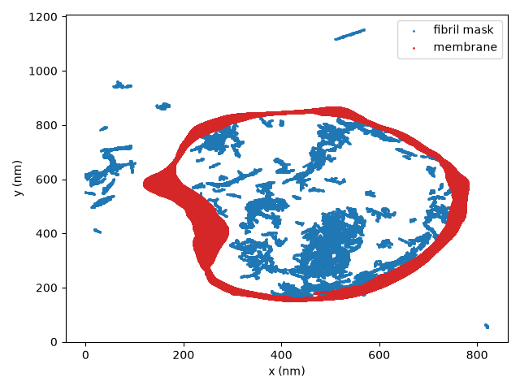
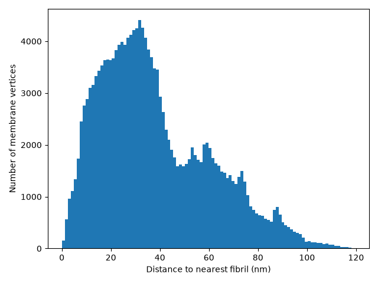
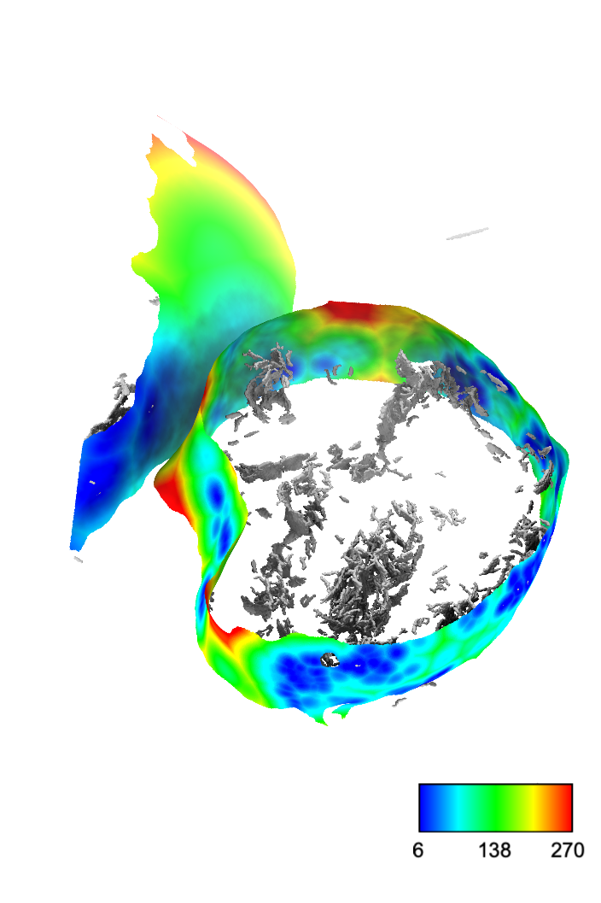

# surface_distance_from_mrc

Compute, per vertex of one or more [pycurv](https://github.com/kalemariaheinz/pycurv) membrane surface graphs (`.gt`), the distance to the nearest voxel of a segmentation mask (`.mrc`).

For each membrane graph the script:
- finds the nearest segmentation-mask voxel to every mesh vertex (`scipy.spatial.cKDTree`)
- writes an annotated `.gt` graph and `.vtp` surface with a new vertex property (named `mrc_distance` by default; see `--column-name`)
- if a morphometrics CSV with the same base name sits next to the graph, writes a copy with that column added
- saves a mask-vs-membrane scatter plot (for sanity check + make sure mrc is properly oriented and not flipped) and a distance histogram per graph
- spot-checks a random sample of vertices to confirm the graph and CSV values agree
- if the graph or CSV already has a property/column with the chosen name, stops with an error instead of overwriting it -- rerun with a different `--column-name`

## Requirements

Python environment with `click`, `numpy`, `pandas`, `scipy`, `matplotlib`, `mrcfile`, `graph-tool`, and `pycurv`.
You should be able to run this in the [Surface Morphometrics](https://github.com/baradlab/surface_morphometrics) conda environment

## Usage
Example of running this code on fibrils segmented inside a lysosome: 
```bash
python surface_distance_from_mrc.py \
    --mask-mrc 208_fibers_dragonfly_labels_flipx_binary_bin8_mapfix_flipx.mrc \
    --graph-glob "1_morph/208_bin8_manual_clean_merged_segmented_lyso?.*_refined.gt" \
    --apix 1.741 \
    --output-dir lyso_fibril_patches
```

Run `python surface_distance_from_mrc.py --help` for the full option list, including `--column-name` (name of the new property/column, default `mrc_distance`), `--min-label` (for multi-label masks), `--unit`, `--n-check`/`--seed` (spot-check sampling), and `--plots/--no-plots`.

**Note on `--apix`:** it must be in the same physical unit as the graph's own vertex coordinates (typically nm for pycurv output), not necessarily the raw MRC header pixel size in Ångström — check your pipeline's convention before running.

## Output

Written to `--output-dir`:
- `<graph>_mrc_distance.gt` / `.vtp` — membrane graph/surface with the new distance property
- `<csv>_with_mrc_dist.csv` — original morphometrics table plus the new distance column (only if a matching CSV was found)
- `<graph>_mask_vs_membrane.png`, `<graph>_mrc_distance_histogram.png` — diagnostic plots (unless `--no-plots`)

### Plots:
Scatter plot showing all XY coordinates (all Z planes are shown together)


Histogram of distances:



### Distances
We can use [MorphometricsX](https://github.com/baradlab/morphometricsx) bundle in [Chimerax](https://github.com/RBVI/ChimeraX) to display the new label on the surface and see the segmentation as well:


This file can then be used in [ParaView](https://www.paraview.org/) for further analysis. 
